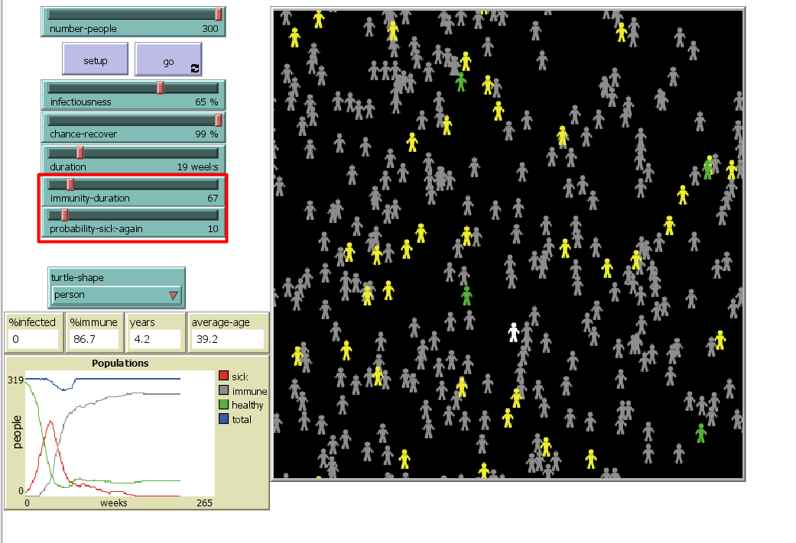

## Комп'ютерні системи імітаційного моделювання
## СПм-22-5, **Бондар Олег Володимирович**
### Лабораторна робота №**2**. Редагування імітаційних моделей у середовищі NetLogo

 

### Варіант 3, модель у середовищі NetLogo:
[Virus](https://www.netlogoweb.org/launch#https://www.netlogoweb.org/assets/modelslib/Sample%20Models/Biology/Virus.nlogo)

 

### Внесені зміни у вихідну логіку моделі, за варіантом:

**Додати вплив віку на інфікування та результат захворювання** 
infection-probability і recover-probability - це функції, які обчислюють ймовірність зараження та ймовірність одужання для кожної особи в залежності від її віку. Ці функції враховують вік особи, щоб симулювати той факт, що імунітет та вразливість до хвороби можуть змінюватися з віком. Їх логіка розділена на три частини відповідно до вікових категорій (діти, дорослі, старші люди).
<pre>
to-report infection-probability 
  ;; Define an age-dependent probability of infection
  ;; You can modify this formula to suit your needs
  if age < 52 * 20
  [report (infectiousness + 20 - (age / 52))] ;;діти заболівають легше, но з часом імунітет стає сильнішим
  if age >= 52 * 20 and age <= 52 * 50
  [report infectiousness]  ;;у дорослих звичайний шанс заболіти
  if age > 52 * 50
  [report infectiousness + (age / 52) - 50] ;;старі люди з кожним роком заболівають все легше. Після 50 років на 1% легше за рік
end
to-report recover-probability 
  ;; Define an age-dependent probability of infection
  ;; You can modify this formula to suit your needs
  if age < 52 * 20
  [report (chance-recover - 20 + (age / 52))] ;;дітям важче боротися з заболіванням, но з часом імунітет стає сильнішим
  if age >= 52 * 20 and age <= 52 * 50
  [report chance-recover]  ;;у дорослих звичайний шанс виболіти
  if age > 52 * 50
  [report chance-recover - ((age / 52) - 50)] ;;старі люди з кожним роком важче переносять хворобу. Після 50 років на 1% важче за рік
end
  </pre>

Зробив зміни у процедурах infect та recover-or-die, щоб вони вони правильно вираховували ймовірність зараження та ймовірність одужання.

;; If a turtle is sick, it infects other turtles on the same patch.
;; Immune turtles don't get sick.
to infect ;; turtle procedure
  ask other turtles-here with [ not sick? and not immune? ]
    [ let age-influence infection-probability
      if random-float 100 < age-influence
      [ get-sick ] ]
end
                            
;; Once the turtle has been sick long enough, it
;; either recovers (and becomes immune) or it dies.
to recover-or-die ;; turtle procedure
  if sick-time > duration                        ;; If the turtle has survived past the virus' duration, then
    [ ifelse random-float 100 < recover-probability    ;; either recover or die
      [ become-immune ]
      [ die ] ]
end

                                
**Додати вплив ступеня поширення захворювання (поточного відсотка інфікованих) на вірогідність появи нових агентів.**
Було внесено зміну до процедури to update-global-variables: додано встановлення chance-reproduce в залежності від кількості інфікованих.
Чим більше інфікованих, тим менше шанс на вірогідність появи нових агентів. Раніше вірогідність завжди була 1%.
<pre>
to update-global-variables
  if count turtles > 0
    [ set %infected (count turtles with [ sick? ] / count turtles) * 100
      set %immune (count turtles with [ immune? ] / count turtles) * 100 
      set chance-reproduce 1 - %infected / 100 ;; встановлення chance-reproduce в залежності від кількості інфікованих 
  ]
end
</pre>

**Додати можливість регулювання тривалості імунітету та вірогідності захворіти повторно.** 
Додав цей функціонал, використовуючи desktop версію Netlogo. 
Змінив поведінку програми, щоб люди з імунітетом могли повторно заболіти з деяким шансом в залежності від початкових параметрів.
<pre>
    to infect ;; turtle procedure
  ask other turtles-here with [ not sick? ]
    [
      ifelse immune?
      [if random-float 100 < probability-sick-again ;;probability of getting sick again
        [ get-sick ]]
      [if random-float 100 < infection-probability
          [ get-sick ]]
  ]
end
</pre>

### Внесені зміни у вихідну логіку моделі, на власний розсуд:

Фінальний код моделі та її інтерфейс доступні за [посиланням](example-model.nlogo). *// якщо вносили зміни до інтерфейсу середовища моделювання - то експорт потрібен у форматі nlogo, як тут. Інакше, якщо змінювався лише код логіки моделі, достатньо викласти лише його, як [тут](example-model-code.html),якщо експортовано з десктопної версії NetLogo, або окремим текстовим файлом, шляхом копіпасту з веб-версії*.
 

## Обчислювальні експерименти
*// тут повинен бути наведений опис одного експерименту, за аналогією з першої л/р.* 
### 1. Вплив дисциплінованості водіів на середню швидкість переміщення
