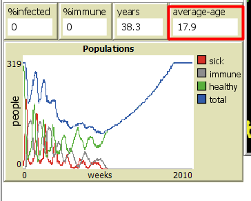
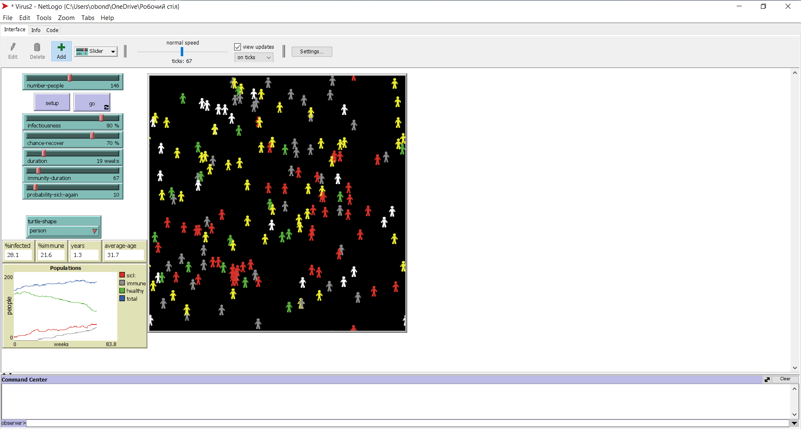

## Комп'ютерні системи імітаційного моделювання
## СПм-22-5, **Бондар Олег Володимирович**
### Лабораторна робота №**2**. Редагування імітаційних моделей у середовищі NetLogo

 

### Варіант 3, модель у середовищі NetLogo:
[Virus](https://www.netlogoweb.org/launch#https://www.netlogoweb.org/assets/modelslib/Sample%20Models/Biology/Virus.nlogo)

 

### Внесені зміни у вихідну логіку моделі, за варіантом:

**Додати вплив віку на інфікування та результат захворювання.** 

 Infection-probability і recover-probability - це функції, які обчислюють ймовірність зараження та ймовірність одужання для кожної особи в залежності від її віку. Ці функції враховують вік особи, щоб симулювати той факт, що імунітет та вразливість до хвороби можуть змінюватися з віком. Їх логіка розділена на три частини відповідно до вікових категорій (діти, дорослі, старші люди).

<pre>
to-report infection-probability 
  ;; Define an age-dependent probability of infection
  ;; You can modify this formula to suit your needs
  if age < 52 * 20
  [report (infectiousness + 20 - (age / 52))] ;;діти заболівають легше, но з часом імунітет стає сильнішим
  if age >= 52 * 20 and age <= 52 * 50
  [report infectiousness]  ;;у дорослих звичайний шанс заболіти
  if age > 52 * 50
  [report infectiousness + (age / 52) - 50] ;;старі люди з кожним роком заболівають все легше. Після 50 років на 1% легше за рік
end
to-report recover-probability 
  ;; Define an age-dependent probability of infection
  ;; You can modify this formula to suit your needs
  if age < 52 * 20
  [report (chance-recover - 20 + (age / 52))] ;;дітям важче боротися з заболіванням, но з часом імунітет стає сильнішим
  if age >= 52 * 20 and age <= 52 * 50
  [report chance-recover]  ;;у дорослих звичайний шанс виболіти
  if age > 52 * 50
  [report chance-recover - ((age / 52) - 50)] ;;старі люди з кожним роком важче переносять хворобу. Після 50 років на 1% важче за рік
end
  </pre>

Зробив зміни у процедурах infect та recover-or-die, щоб вони вони правильно вираховували ймовірність зараження та ймовірність одужання.

<pre>
;; If a turtle is sick, it infects other turtles on the same patch.
;; Immune turtles don't get sick.
to infect ;; turtle procedure
  ask other turtles-here with [ not sick? and not immune? ]
    [ let age-influence infection-probability
      if random-float 100 < age-influence
      [ get-sick ] ]
end
                            
;; Once the turtle has been sick long enough, it
;; either recovers (and becomes immune) or it dies.
to recover-or-die ;; turtle procedure
  if sick-time > duration                        ;; If the turtle has survived past the virus' duration, then
    [ ifelse random-float 100 < recover-probability    ;; either recover or die
      [ become-immune ]
      [ die ] ]
end
</pre>

                                
**Додати вплив ступеня поширення захворювання (поточного відсотка інфікованих) на вірогідність появи нових агентів.**
 Було внесено зміну до процедури update-global-variables: додано встановлення chance-reproduce в залежності від кількості інфікованих.
Чим більше інфікованих, тим менше шанс на вірогідність появи нових агентів. Раніше вірогідність завжди була 1%.
<pre>
to update-global-variables
  if count turtles > 0
    [ set %infected (count turtles with [ sick? ] / count turtles) * 100
      set %immune (count turtles with [ immune? ] / count turtles) * 100 
      set chance-reproduce 1 - %infected / 100 ;; встановлення chance-reproduce в залежності від кількості інфікованих 
  ]
end
</pre>

**Додати можливість регулювання тривалості імунітету та вірогідності захворіти повторно.** 
 Додав цей функціонал, використовуючи desktop версію Netlogo. 
Змінив поведінку програми, щоб люди з імунітетом могли повторно заболіти з деяким шансом в залежності від початкових параметрів.
<pre>
    to infect ;; turtle procedure
  ask other turtles-here with [ not sick? ]
    [
      ifelse immune?
      [if random-float 100 < probability-sick-again ;;probability of getting sick again
        [ get-sick ]]
      [if random-float 100 < infection-probability
          [ get-sick ]]
  ]
end
</pre>

Видалив глобальну змінну, адже тепер за неї відповідає слайдер.
<pre>
 immunity-duration
</pre>

### Внесені зміни у вихідну логіку моделі, на власний розсуд:
 Змінено максимальний вік, якого може досягти людина, тепер це 100 років.
<pre>
 set lifespan 100 * 52
</pre>

 Кожній віковій групі був наданий свій колір, якщо вона нехвора або не імунна. Жовтий - дитина, зелений - дорослий, білий - людина похілого віку.
<pre>
 to update-display
  ask turtles
    [ if shape != turtle-shape [ set shape turtle-shape ]
      set color ifelse-value sick? [ red ] [ ifelse-value immune? [ grey ] [ set-color ] ] ]
end

to-report set-color
  if age < 20 * 52
  [report yellow]
  if age >= 20 * 52 and age < 50 * 52
  [report green]
  if age >= 50 * 52
  [report white]
  
end
</pre>

Додано змінну "середній вік" та монітор цієї змінної в інтерфейсі. Ця змінна відповвідає за середній вік у популяціх у роках.
<pre>
 set average-age mean [age] of turtles / 52
</pre>

Додано обмеження на ріст популяції. Тепер розможення можливе лише, якщо середній вік у популяції більше 10 років.
<pre>
 to reproduce
  if count turtles < carrying-capacity and random-float 100 < chance-reproduce and average-age > 10
    [ hatch 1
      [ set age 1
        lt 45 fd 1
        get-healthy ] ]
end
</pre>

 Для поліпшення руху людей і врахування соціальних взаємодій і статусу інфікованості введено зміни до процедури move. Зазначений код враховує, що заражені люди будуть рухатися повільніше, а незаражені люди - намагатися уникати контакту з інфікованими.
<pre>
 ;; Turtles move about at random.
to move ;; turtle procedure
  let nearby-turtles other turtles in-radius 5 ; визначити туртлів у радіусі 5 одиниць
    if any? nearby-turtles with [sick?] [
      ; Якщо є інфіковані туртли поблизу, спробувати уникнути контакту
      rt random 40 - 20
      lt random 40 - 20
    ]
  let speed 0
  ifelse not sick? [set speed 1] [set speed 0.5];; швидкість руху
    ifelse random-float 100 < 70 ;; ймовірність змінити напрямок
    [
      rt random 40 - 20 ;; випадковий поворот на +/- 20 градусів
      lt random 40 - 20
    ]
    [
      ; продовжити рух у поточному напрямку
    ]
    fd speed ; рух на визначену відстань
end
</pre>

Фінальний код моделі та її інтерфейс доступні за [посиланням](Virus2.nlogo). 
 

## Обчислювальні експерименти
### 1. Вплив кількості людей в популяції, а отже і щільності населення, на перебіг епідемії в популяції
Досліджується залежність кількості інфікованих людей і людей з імунітетом через 20 років від початку епідемії (1040 тактів) від числа людей у популяції.
Експерименти проводяться при 50-300 людей, з кроком 50, усього 6 симуляцій.  
Інші керуючі параметри мають значення за замовчуванням:
- **infectiousness**: 65%
- **chance-recover**: 75%
- **duration**: 20
- **imunity-duration**:52
- **probability-sick-again**:10

<table>
<thead>
<tr><th>Кількість людей</th><th>% інфікованих</th><th>% несприйнятливих</th></tr>
</thead>
<tbody>
<tr><td>50</td><td>0</td><td>19,7</td></tr>
<tr><td>100</td><td>4,1</td><td>15,1</td></tr>
<tr><td>150</td><td>26,2</td><td>15</td></tr>
<tr><td>200</td><td>30</td><td>46</td></tr>
<tr><td>250</td><td>47,6</td><td>39,6</td></tr>
<tr><td>300</td><td>28</td><td>54</td></tr>
</tbody>
</table>

За цими даними видно, що при збільшенні кількості людей у популяції зазвичай збільшується і кількість інфікованих. Це досить логічно, оскільки більше людей означає більше можливих контактів і швидше поширення інфекції. Проте, при великій кількості людей (300) % інфікованих може стати меншим, оскільки частина популяції набуде імунітет.
З кількістю несприйнятливих (людей з імунітетом) ситуація складніша. Хоча зазвичай більше людей призводить до більшої кількості несприйнятливих, але ця залежність не є прямою. Наприклад, при 200 людях % несприйнятливих менше, ніж при 100 або 250 людях. Це може бути пов'язано з іншими факторами, такими як швидкість інфекції та швидкість одужання.
